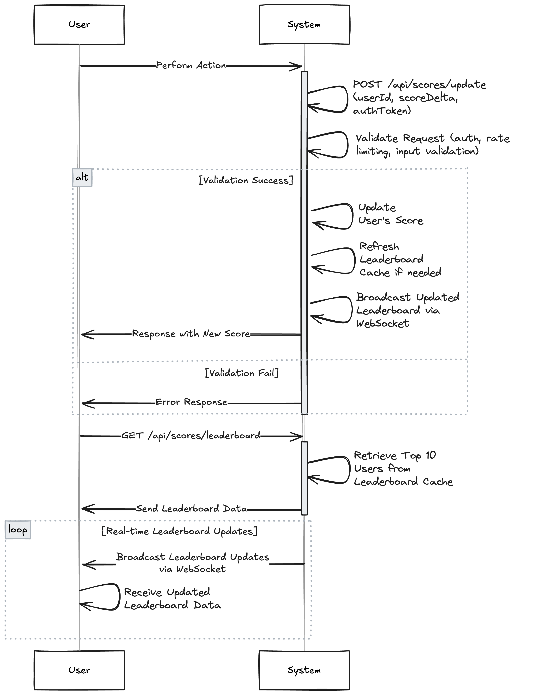
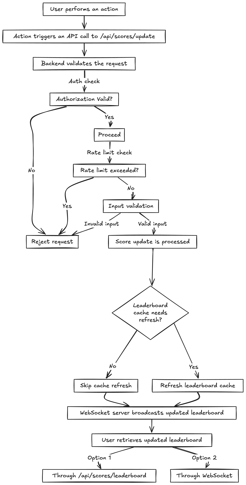

# Live Scoreboard Module

## Overview

This module provides the functionality for managing and updating a live scoreboard. The scoreboard displays the top 10 user scores in real-time, ensuring secure and efficient score updates while preventing unauthorized access.

---

## Features

1. **Real-Time Scoreboard Updates**
   - Updates the scoreboard dynamically with the top 10 users' scores.
   - Utilizes WebSocket for live data transmission to clients.

2. **Secure Score Update API**
   - API endpoint to update user scores upon action completion.
   - Implements authentication and validation to prevent unauthorized updates.

3. **Efficient Leaderboard Management**
   - Maintains a sorted leaderboard with optimized queries.
   - Designed for scalability with high user activity.

---

## Use Case Diagram



### Actors

1. **User**
2. **System**

### Use Cases

1. **Update Score**
   - **Description**: User performs an action that triggers a score update.
   - **Actors**: User, System
   - **Steps**:
     1. User performs an action.
     2. System sends a POST request to `/api/scores/update` with `userId`, `scoreDelta`, and `authToken`.
     3. System validates the request (authentication, rate limiting, input validation).
     4. System updates the user's score.
     5. System refreshes the leaderboard cache if needed.
     6. System sends a response back to the user with the new score.
     7. System broadcasts the updated leaderboard to connected clients via WebSocket.

2. **Get Leaderboard**
   - **Description**: User retrieves the top 10 users and their scores.
   - **Actors**: User, System
   - **Steps**:
     1. User sends a GET request to `/api/scores/leaderboard`.
     2. System retrieves the top 10 users from the leaderboard cache.
     3. System sends the leaderboard data back to the user.

3. **Receive Leaderboard Updates**
   - **Description**: User receives real-time updates of the leaderboard.
   - **Actors**: User, System
   - **Steps**:
     1. System broadcasts leaderboard updates to connected clients via WebSocket.
     2. User receives the updated leaderboard data in real-time.

### Relationships

- **User** interacts with **System** to **Update Score**.
- **User** interacts with **System** to **Get Leaderboard**.
- **System** broadcasts updates to **User** for **Receive Leaderboard Updates**.

## API Endpoints

### 1. Update Score

**URL:** `/api/scores/update`

**Method:** `POST`

**Description:** Updates the score of a user upon action completion.

#### Request

```json
{
  "userId": "<string>",
  "scoreDelta": <integer>,
  "authToken": "<string>"
}
```

- `userId`: The unique identifier for the user.
- `scoreDelta`: The number of points to add to the user's score.
- `authToken`: A token to authenticate the user.

#### Response

- **200 OK**:

  ```json
  {
    "message": "Score updated successfully",
    "newScore": <integer>
  }
  ```

- **400 Bad Request**: Invalid request payload.
- **401 Unauthorized**: Authentication failed.
- **500 Internal Server Error**: Unexpected server issue.

### 2. Get Leaderboard

**URL:** `/api/scores/leaderboard`

**Method:** `GET`

**Description:** Retrieves the top 10 users and their scores.

#### Response

- **200 OK**:

  ```json
  {
    "leaderboard": [
      { "userId": "<string>", "score": <integer> },
      { "userId": "<string>", "score": <integer> }
    ]
  }
  ```

- **500 Internal Server Error**: Unexpected server issue.

---

## Implementation Details

### Authentication & Authorization

- Use JWT for validating user tokens (`authToken`).
- Ensure the `userId` in the token matches the `userId` in the request payload.

### Data Model

- **User**:
  - `userId`: Unique identifier.
  - `score`: Current score.
- **Leaderboard Cache**:
  - Precomputed top 10 users stored in memory for fast retrieval.

### WebSocket Integration

- A WebSocket server broadcasts leaderboard updates to connected clients.
- Triggered on score updates.

### Rate Limiting

- Implement a rate limiter to prevent frequent score updates from the same user.
- Threshold: 1 update per second.

### Input Validation

- Validate `userId` format and `scoreDelta` range before processing requests.

### Security

- Use HTTPS for secure data transmission.
- Sanitize inputs to prevent SQL injection or other attacks.

---

## Flow Diagram

A diagram illustrating the flow of execution is attached below:



1. User performs an action.
2. Action triggers an API call to `/api/scores/update`.
3. Backend validates the request (auth, rate limit, input validation).
4. Score update is processed, and leaderboard cache is refreshed if needed.
5. WebSocket server broadcasts the updated leaderboard to connected clients.
6. User retrieves the updated leaderboard through `/api/scores/leaderboard` or WebSocket.

---

## Improvements

1. **Performance Optimization**:
   - Use a Redis-based leaderboard cache to handle high traffic.
   - Implement batch updates for high-frequency score changes.

2. **Additional Security**:
   - Add HMAC signature validation to prevent request tampering.
   - Monitor and log suspicious activity for potential abuse detection.

3. **Testing**:
   - Ensure comprehensive unit and integration tests for all API endpoints.
   - Simulate real-world load conditions to validate scalability.
